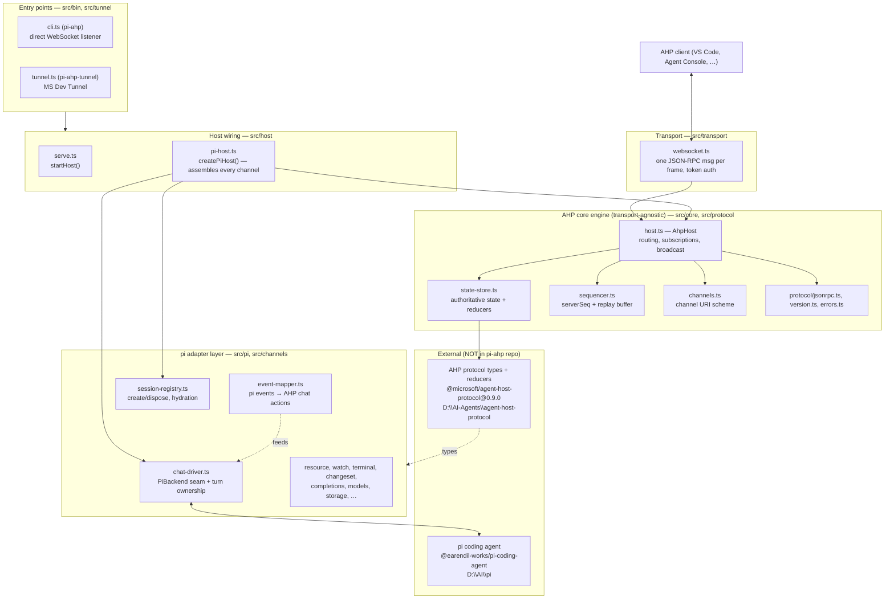
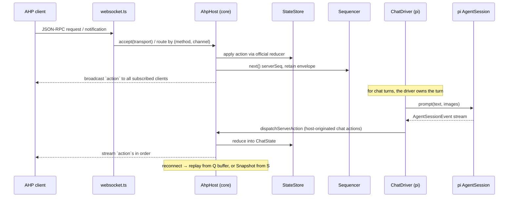

# pi-ahp — Architecture Analysis

This document explains how `pi-ahp` is built, and — most importantly for
contributors — **where the boundaries are**. The single most common mistake is
treating the `src/pi/` folder as if it were pi's own code. It is not. Reading
this document before touching any code will save real time.

## 1. What pi-ahp is

`pi-ahp` is an [Agent Host Protocol](https://microsoft.github.io/agent-host-protocol/)
(AHP) **host**. It embeds the [pi coding agent](https://github.com/earendil-works/pi)
in-process and exposes pi's sessions to AHP clients (VS Code's Agents window,
Agent Console, …) over WebSocket.

In one line: **pi-ahp = an AHP host engine, wired to pi behind a narrow seam.**

It speaks AHP protocol version **0.9.0** (see `src/protocol/version.ts`). The
feature-by-feature support matrix is maintained in [README.md](../README.md).

## 2. The three external pieces (not in this repo)

`pi-ahp` sits at the intersection of two external projects. **Neither one's
source is committed here.**

| Piece | Role | Consumed as | Local reference checkout |
| --- | --- | --- | --- |
| **pi coding agent** | the actual agent (models, tools, session tree) | npm SDK: `@earendil-works/pi-coding-agent`, `@earendil-works/pi-ai` (`0.87.1`) | `D:\AI\pi` (the `pi-monorepo`) |
| **AHP protocol** | the wire protocol + state model | npm package: `@microsoft/agent-host-protocol` (`0.9.0`, patched) + the spec | `D:\AI-Agents\agent-host-protocol` (the monorepo) |

- pi's real source lives in the monorepo at `D:\AI\pi` (package folders under
  `D:\AI\pi\packages`, e.g. `coding-agent`, `ai`). **Never copy pi source into
  `pi-ahp`.** See [pi-integration-boundary.md](pi-integration-boundary.md).
- The AHP spec and the protocol TypeScript source live in the monorepo at
  `D:\AI-Agents\agent-host-protocol` (spec in `docs/specification`, types in
  `types/`, TS client in `clients/typescript`). A local, git-ignored copy of
  the spec/guide is kept for offline reading at
  [reference/](reference/README.md).
- `pi-ahp` applies a small local patch to the published AHP package
  (`patches/@microsoft__agent-host-protocol.patch`) — it rewrites a handful of
  `const enum` declarations to plain `enum` in the shipped `.d.ts` files. If you
  upgrade the AHP dependency, verify that patch still applies and still does
  anything.

## 3. Layered architecture



Read it top-down: **L2 is generic AHP** and knows nothing about pi. **L3 is
the pi adapter** and is the only layer that imports pi. **L4/L5 wire it up.**
The dependency arrows point *inward* (toward the protocol core); pi is only
ever reached from L3.

## 4. The AHP core engine (L2) — protocol, not pi

This is the heart, and it is deliberately **pi-agnostic**. It implements the
AHP host side of the protocol. The doctrine (see the spec's
[Doctrine](https://microsoft.github.io/agent-host-protocol/guide/doctrine) and
[State model](https://microsoft.github.io/agent-host-protocol/guide/state-model);
offline copies live under [reference/ahp-protocol/](reference/README.md)):

- The **host owns the authoritative state** for every channel. Clients apply
  their own actions optimistically and reconcile when the host echoes them
  back in server order, so N clients converge on the same view.
- **Channels are the routing key.** Every command and notification carries a
  top-level `params.channel: URI`, so `(method, channel)` fully dispatches a
  message. Schemes: `ahp-root://`, `ahp-session:/…`, `ahp-chat:/…`,
  `ahp-terminal:/…`, `ahp-changeset:/…`, `ahp-resource-watch:/…`.

Key files:

- **`src/core/host.ts` — `AhpHost`.** Connection lifecycle, message routing,
  subscriptions, the single write path (`dispatchServerAction` → `#commit`),
  and broadcast to every subscribed client. It is generic: it knows nothing
  about pi. All pi-specific behavior is injected through the
  `HostCapabilities` interface (catalogue, session lifecycle, terminals,
  resources, watches, completions, session config, turn paging, and the
  **hydrator**).
- **`src/core/state-store.ts` — `StateStore`.** Holds an immutable state tree
  per channel, mutated only by running actions through the **official AHP
  reducers** (`rootReducer`, `sessionReducer`, `chatReducer`,
  `terminalReducer`, `changesetReducer`, `resourceWatchReducer`). Reducers are
  total — an unrecognized action is a no-op, which is how forward compatibility
  works. Terminal output is capped (1 MB retained) so reconnect snapshots
  cannot grow unbounded.
- **`src/core/sequencer.ts` — `Sequencer`.** The host is the sole ordering
  authority. Every accepted action gets a monotonically increasing `serverSeq`
  and is kept in a bounded ring buffer (default 1000) so a reconnecting client
  can **replay the gap** instead of refetching every snapshot.
- **`src/core/channels.ts`.** Channel URI scheme helpers and the
  `channelKind(uri)` classifier. Deliberately strict: guessing a scheme wrong
  would install the wrong reducer.
- **`src/core/connection.ts`.** One transport + its per-socket subscriptions +
  a `ClientWorkarounds` shim (client-specific fixes on the wire).
- **`src/protocol/jsonrpc.ts`, `version.ts`, `errors.ts`.** JSON-RPC 2.0
  framing, version negotiation (client offers versions most-preferred-first;
  no overlap → `UnsupportedProtocolVersion`), and typed protocol errors.

**Reconnect semantics** (in `host.ts` `#reconnect`): if the client's
`lastSeenServerSeq` is still inside the replay buffer, the host returns a
`Replay` result (the missed actions). Otherwise (buffer evicted, or a fresh
host process) it returns a `Snapshot` result (current state per subscribed
channel). Durable channels are re-materialized by the **hydrator** first.

## 5. The pi adapter layer (L3) — the only place pi is touched

Everything in `src/pi/` and `src/channels/` is pi-ahp's own code. It imports
pi as an SDK and translates between pi's world and AHP's world.

### 5.1 The `PiBackend` seam

`src/pi/chat-driver.ts` defines the **narrow interface** the whole host needs
from pi:

```ts
export interface PiBackend {
  subscribe(listener: (event: AgentSessionEvent) => void): () => void;
  prompt(text, images?, signal?): Promise<void>;
  steer(text, images?, signal?): Promise<void>;
  abort(): Promise<void>;
  selectModel?(selection: ModelSelection): Promise<void>;
  currentSelection?(): ModelSelection | undefined;
  truncate?(entryId: string): Promise<boolean>;
  dispose?(): void;
}
```

`src/pi/in-process-backend.ts` — `InProcessPiBackend` — is the production
implementation: it wraps a real pi `AgentSession` (created via
`createAgentSessionFromServices`) and implements `PiBackend`. This seam exists
so the mapper and driver never depend on pi's concrete types; a subprocess
backend could satisfy the same interface.

### 5.2 Turn ownership

`src/pi/chat-driver.ts` — the chat channel driver. The **host owns the turn**:
a client's `chat/turnStarted` is reduced into authoritative state *first*, then
handed to the backend. Everything the agent emits comes back through
`TurnMapper` and is dispatched as host-originated actions, so every subscribed
client sees the same stream in the same order.

A subtle-but-important design point: **queued messages never reach pi.** The
protocol's own state *is* the queue (`ChatState.queuedMessages`, with ids the
client chose); the host consumes the head on idle by dispatching a
`chat/turnStarted` carrying `queuedMessageId`, which the reducer applies
atomically. Pushing the queue down to pi would duplicate state and silently
merge two user messages into one turn.

### 5.3 Event mapping (the load-bearing piece)

`src/pi/event-mapper.ts` — `TurnMapper`. A **pure function of pi's event
stream**: feed it a recorded `AgentSessionEvent[]` and it yields the
`StateAction[]` a client would have seen. No sockets, no model, no clock —
which is what makes turn semantics unit-testable (see `test/mapper-fixtures.test.ts`).

It bridges three structural mismatches between pi and AHP:

1. **Turn granularity.** pi nests three levels (agent *run* → pi *turn* →
   content blocks); AHP has two (a turn and its `responseParts`). So one AHP
   turn spans everything from `prompt()` to `agent_settled`, which may contain
   several agent runs (retries, post-compaction retries) and several assistant
   messages. Mapping `agent_end` to `chat/turnComplete` would close the turn
   early and drop everything after it.
2. **Part identity.** pi's `contentIndex` restarts at 0 per assistant message
   and carries no message id, so parts are keyed
   `<turnId>:<message ordinal>:<contentIndex>` instead.
3. **Part creation.** `chat/delta` *appends* to a part that must already
   exist; parts are created lazily on first content.

### 5.4 Session lifecycle and durability

- **`src/pi/session-registry.ts` — `SessionRegistry`.** Creates and disposes
  live sessions, resolves client actions against them, and is the source of
  the `root/session*` notifications.
- **`src/pi/session-storage.ts` — `PiSessionStorage`.** The durability
  boundary. Backed by pi's `SessionManager`, sessions live on disk (append-only
  trees under pi's data dir) and **survive a host restart**. Drafts and
  unconsumed message queues do *not* survive a restart (see the README matrix).
- **`src/pi/session-hydrator.ts` — `SessionHydrator`.** Implements the
  `ChannelHydrator` capability: when a client subscribes to (or reconnects
  with) a durable-but-not-in-memory channel, the hydrator rebuilds its state
  from disk. This is what makes "completed history recovers after restart"
  true.
- **`src/pi/history.ts`, `turn-paging.ts`.** Read pi's on-disk history and page
  it into AHP `fetchTurns` / `chat/turnsLoaded`.

### 5.5 Other adapter services

| File | Responsibility |
| --- | --- |
| `src/pi/models.ts` | pi model runtime → AHP `AgentInfo` / `ModelSelection`; thinking-level plumbing. |
| `src/pi/session-catalogue.ts` | `listSessions` backed by pi's on-disk sessions. |
| `src/pi/completions.ts` | `@` file completions (the only advertised trigger). |
| `src/pi/resource-service.ts` / `resource-paths.ts` | Host-local `file:` resources; path policy/sandboxing. |
| `src/pi/resource-watch.ts` / `parcel-watch-*.ts` / `chokidar-watch-source.ts` / `watch-source.ts` | `createResourceWatch` → native/parcel/chokidar backends. |
| `src/host/terminal-service.ts` | Client-owned interactive terminals (PTY via `node-pty`). |
| `src/pi/changeset-service.ts` / `git-changes.ts` / `changeset-uri.ts` | Changeset channels: latest commit + uncommitted changes in Git workspaces. |
| `src/pi/session-config.ts` | `resolveSessionConfig` / `sessionConfigCompletions`. |
| `src/pi/project-trust.ts` | pi project-trust resolution (trust-gated resources). |
| `src/pi/metadata-store.ts` | Profile-scoped metadata (newer feature; see recent commits). |
| `src/pi/image-input.ts` / `image-mime.ts` | Embedded image attachments for vision-capable models. |
| `src/pi/user-message.ts` / `message-input.ts` / `activity.ts` / `session-title.ts` / `delete-session.ts` | Small mapping/lifecycle helpers. |

Channel installers live in `src/channels/` (`root.ts`, `session.ts`,
`chat.ts`, `terminal.ts`) and wire a channel's initial state and its
notifications onto the host.

## 6. Transport and entry points (L1, L5)

- **`src/transport/websocket.ts`.** AHP is transport-agnostic; this carries one
  JSON-RPC message per WebSocket frame. **Auth is a transport concern**, done
  during the HTTP upgrade: `?token=` (generic AHP) or `?tkn=` (VS Code's
  manual-connection-token name) must match or the upgrade is rejected 401.
- **`src/host/serve.ts` — `startHost`.** Shared host construction; reads
  `serverInfo` from the package manifest (never a hardcoded copy) and wires the
  WebSocket server + shutdown.
- **`src/host/direct-settings.ts`.** Reads/creates
  `~/.pi/ahp/settings.json` (host, port, token). `PI_AHP_DIR` overrides the
  data dir.
- **`src/bin/cli.ts`** (`pi-ahp`) — the direct WebSocket listener entry point.
- **`src/bin/tunnel.ts`** (`pi-ahp-tunnel`) + **`src/tunnel/devtunnel.ts`,
  `discovery.ts`** — the MS Dev Tunnel entry point for clients that need it
  (requires the `devtunnel` CLI).

## 7. A request's journey (end to end)



## 8. Testing strategy

- **The mapper is the linchpin of testability.** Because `event-mapper.ts` is
  pure, `test/mapper-fixtures.test.ts`, `test/pi-replay.test.ts`, and the
  `test/support/recorded-*` + `replay.ts` helpers replay **recorded pi event
  streams** and assert the exact AHP actions a client would have seen — no
  model, no network.
- **Protocol surface** tests (`test/protocol-surface.test.ts`,
  `test/schema.test.ts`, `test/handshake.test.ts`, `test/reconnect.test.ts`,
  `test/subscriptions.test.ts`) exercise the generic core against the AHP
  contract.
- **Session lifecycle / durability** (`test/session-lifecycle.test.ts`,
  `test/session-hydration.test.ts`, `test/active-turn-reconnect.test.ts`, the
  `*.test.serial.ts` files) cover create/dispose and restart recovery. Serial
  files run with `--test-concurrency=1` (shared fixtures).
- Run them with `pnpm test`; type-check with `pnpm check` (`tsc`); lint with
  `pnpm lint` (Biome).

## 9. Where to make changes (cheat sheet)

| You want to… | Touch | Do **not** touch |
| --- | --- | --- |
| Change protocol wiring / routing / sequencing | `src/core/*`, `src/protocol/*` | `src/pi/*` |
| Add a new AHP channel this host serves | `src/core/channels.ts` (scheme), a `src/channels/*.ts` installer, register in `pi-host.ts` | pi internals |
| Change how pi events become AHP actions | `src/pi/event-mapper.ts`, `src/pi/chat-driver.ts` | `src/core/*` |
| Change which pi features are exposed | the relevant `src/pi/*` service + its capability in `pi-host.ts` | copy pi source |
| Change transport / auth / CLI | `src/transport/websocket.ts`, `src/host/*`, `src/bin/*`, `src/tunnel/*` | `src/core/*` |
| Bump the AHP protocol version | `src/protocol/version.ts`, re-check `patches/`, update README matrix | — |

## 10. Guiding principles (read before contributing)

1. **Keep pi out of the core.** `src/core` and `src/protocol` must stay
   pi-agnostic. pi is reachable only through `PiBackend` (L3). If you find
   yourself importing `@earendil-works/pi-*` in `src/core`, you're in the wrong
   layer.
2. **The host is the sole source of truth and ordering.** All agent output goes
   through `dispatchServerAction` → reducer → `serverSeq` → broadcast. Never
   let a client or pi mutate host state directly.
3. **Prefer the protocol's own state** (queues, drafts, turn state) over
   duplicating it in the adapter.
4. **Keep the mapper pure** so replay tests keep working.
5. **Distinguish durable vs. ephemeral.** Sessions survive restart (on disk);
   drafts/queues and terminal scrollback do not. New features should say which
   side they're on.
